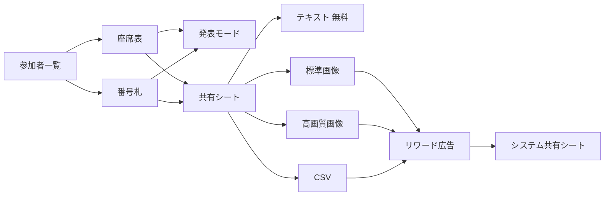

# SakuttoSeat v2.1 要件定義書

**発表モード ＆ 高画質・CSV出力**  
対象バージョン: **2.1.0**（現行は 2.0.0）  
位置づけ: 実装前の戦略・要件。この段階ではコード変更なし。

---

## 0. 判断の軸

「サクッと」の価値は速さそのもの。教室・懇親会・会議のその場で、**決めて・見せて・渡す**のが仕事です。

| 瞬間 | ユーザーの仕事 | v2.1 の答え | 広告 |
|---|---|---|---|
| 決める | 入力・シャッフル・席ロック | 触らない | 出さない |
| 見せる | プロジェクター／TV に投影 | **発表モード** | **出さない** |
| 渡す | LINE・印刷・Excel へ持ち出す | **共有シートの拡張** | **ここで取る** |

v2.0 の広告配置（バナーは常駐、リワードは「欲しい成果物」の直前）は正しいので踏襲します。発表中にバナーや操作ボタンが見えるのは、現場では失敗です。収益は共有の瞬間に寄せます。

---

## 1. 機能の全体像

v2.1 は新画面を増やさず、**既存の2つの終点**を強くします。



**発表モード**は「今、会場に見せる」。ナビ・4ボタン・バナー・追加ボタンを消し、結果だけを全画面にします。無料。広告・課金なし。

**高画質・CSV**は「あとで使う」。現行の共有シートを4択に広げ、有料3種をリワードに繋ぎます。1本の動画で、その起動中の有料書き出しをまとめて解放します（列数解放と同じ「セッション解放」、フラグは別物）。

呼び出し側（座席表・番号札）は今どおり `didTapShare()` だけでよく、成果物の種類は Share モジュールの中で増えます。

---

## 2. As-Is（拡張の起点）

実装から読める現行フローです。

**共有**
- 入口は座席表の下段「共有」、番号札のツールバー共有アイコン。
- `ShareSelectionView` は2択（テキスト無料 / 画像は動画）。detent は約30%。
- 画像は毎回リワード。列数のようなセッション解放はない。
- 画像は `ImageExportRenderer` + Snapshot View。スケールは端末の displayScale。座席表は余白 32pt、番号札は幅 400pt。
- テキスト整形と広告要否は `ShareInteractor`。提示は `ShareRouter` → `RewardedAdGateway` / `ShareSheetPresenter`。

**広告**
- バナー: `AdBannerContainer`（座席表下段、番号札下段）。画面外では Representable を外す。
- リワード: `UnlockRequirement` + `router.presentRewardedAd()`。未準備文言は `RewardedAdCopy`。
- 列数3列以上: `FeatureUnlockState`（起動中のみ）。共有画像とは独立。

**画面クロム**
- 座席表: ナビ（設定ギア）+ 下段4ボタン（お気に入り / 保存 / 共有 / シャッフル）+ バナー。キャンバスに「テーブル追加」。
- 番号札: ナビ（共有・シャッフル）+ バナー。`ActionButtonsView` はない。
- `ActionButtonsView` は4枠固定。5つ目を足す場所ではない。
- iPhone はすでに横向き許可。発表モードで向きを新たに解禁する必要はない。

---

## 3. ユーザーストーリー

ペルソナは「その場の司会」です。教員、幹事、ファシリテーター。パソコンより iPhone が手元にあり、結果は壁に出すか、あとで名簿に残します。

### 発表（現場）

**US-P1 座席表を壁に出す**  
抽選後、座席表で「発表」を押す。全画面になり、ボタン・バナー・設定・テーブル追加が消える。Lightning / AirPlay で出しても操作UIが写らない。席は読める大きさのまま。誤タップでシャッフルやロックが変わらない。

**US-P2 番号札を読み上げる**  
番号札で「発表」を押す。番号と名前が大きく並ぶ。下のバナーが消える。名簿を見ながら「3番、佐藤さん」と呼べる。

**US-P3 すぐ戻って直す**  
発表中に席を直したくなったら、画面をタップして「閉じる」→ 通常画面。ロック・再シャッフル・共有は発表の外で行う。発表中は結果を凍結する。

**US-P4 空のときは出さない**  
テーブルゼロ、または参加者ゼロでは「発表」は出せない（共有ボタンと同じ条件）。

### 書き出し（持ち帰り）

**US-E1 今までどおりテキスト**  
共有 →「テキストで共有」。広告なし。現行文言のまま。

**US-E2 今までどおり標準画像**  
共有 →「画像で共有」→ 確認 → 動画 → シェアシート。見た目は現行 Snapshot（余白あり、画面に近い）。

**US-E3 印刷・投影用の高画質**  
共有 →「高画質画像」。余白と空のフィラーを切った高解像度 PNG。印刷・スライド貼り付けで文字が潰れない。

**US-E4 Excel に載せる**  
共有 →「CSVで書き出す」。Excel / Google スプレッドシートが文字化けしない（UTF-8 BOM）。座席表はテーブル・行・列・氏名。番号札は番号・氏名。空席は出さない（二次利用の名簿用）。

**US-E5 同じ会合で二度目は待たない**  
一度動画を見たら、その起動中は標準画像・高画質・CSVをすぐ出せる。「さっき見たのに」を作らない。列数解放（3列）とは独立。列数の動画でCSVは開かない。

**US-E6 広告が来ない・スキップした**  
未準備は現行の `RewardedAdCopy`。キャンセル / 未完了は書き出さない。シートは閉じ、結果画面に戻る。

---

## 4. 機能仕様

### 4.1 共有シートを「書き出しハブ」にする

現行2択を、**無料1 + 有料3**にする。2段階（形式→画質）にはしない。現場ではタップを増やさない。

| 順 | 項目 | アイコン案 | サブタイトル（未解放） | 対価 |
|---|---|---|---|---|
| 1 | テキストで共有 | `doc.text` | 無料ですぐに共有できます | なし |
| 2 | 画像で共有 | `photo` | 動画を見てきれいな座席表画像を保存・送信 | リワード |
| 3 | 高画質画像 | `photo.badge.plus` など | 余白カット・印刷や投影向き | リワード |
| 4 | CSVで書き出す | `tablecells` | Excel・名簿ソフトで二次利用 | リワード |

解放済みの起動中は、2〜4のサブタイトルを **「この起動中はすぐに書き出せます」** に変える。南京錠アイコンは外す。

detent は **`.medium` 固定**（現行 0.3 では4行が切れる）。ドラッグインジケータは維持。キャンセルは最下段のまま。

呼び出し側のボタンラベルは「共有」のまま。ユーザーは「共有」を押す習慣があるので、入口は増やさない。

### 4.2 高画質画像

現行画像は「画面の写し」。高画質は「成果物」。

| 項目 | 標準画像（現行維持） | 高画質 |
|---|---|---|
| スケール | 端末 displayScale | **常に 3.0**（最低でも displayScale） |
| 余白 | 座席 32pt / 番号札 20pt | **8pt まで締める** |
| フィラー（空セル） | 会場列に合わせて残る | **切る**（テーブル実体だけ） |
| 追加ボタン | 出ない（現行どおり） | 出ない |
| 形式 | `UIImage` のまま | **PNG** を一時ファイル化して渡す |
| ファイル名 | なし（現行） | `座席表_yyyyMMdd.png` / `番号札_yyyyMMdd.png` |

番号札の高画質は、幅を 400 → **内容幅にフィット（目安 600〜834）** し、行間を少し広げて印刷耐性を上げる。ブランド見出し「【サクッと席決め】」は残してよい（共有先での出典）。余白カットは「外の空き」であり、見出し削除ではない。

失敗時は現行の `.imageExportFailed`。巨大レイアウトでメモリ不足になり得るので、失敗コピーは現行のままでよい（内部はログ）。

### 4.3 CSV（二次利用）

**座席表**

```
テーブル,行,列,氏名
A卓,1,1,太郎
A卓,1,2,花子
```

- 行・列はテーブル内の席インデックス（現行テキスト共有と同じ計算）。
- 空席は出さない。
- ロック状態は出さない（名簿用途に不要。出すと「二次利用」が重くなる）。

**番号札**

```
番号,氏名
1,太郎
2,花子
```

共通:
- UTF-8 **BOM 付き**（Windows Excel 前提。ここを外すと「文字化けする」レビューになる）。
- 改行は LF。氏名内のカンマはダブルクォートでエスケープ。
- 一時ファイル `座席表_yyyyMMdd.csv` / `番号札_yyyyMMdd.csv` をシェアシートへ。
- 共有後に一時ファイルを捨てる（Router の責務）。

v2.1 では Excel 専用 `.xlsx`、PDF、複数シートは対象外。

### 4.4 リワードとの結び方

現行画像は「タップのたびに動画」です。列数は「1回見ればその起動中は自由」。**書き出しは列数側に寄せます。** 高画質と CSV を足したあと、毎回動画だと「サクッと」が壊れ、2本目以降の視聴完了率も落ちます。

**ルール**

1. テキストは常に `.none`。
2. 標準画像・高画質・CSVは、未解放なら `.rewardedAd`。
3. 確認アラートは形式ごと。OK で `presentRewardedAd()`。成功したら **書き出し用セッションを解放**して成果物を出す。
4. 以降、同じ起動中の有料3種は確認も動画もスキップし、すぐシェアシート。
5. `notReady` は現行コピー。`notEarned` / 失敗 / キャンセルは何も出さない。
6. **列数の `FeatureUnlockState` とは別フラグ。** 3列の動画で CSV は開かない。CSV の動画で3列も開かない。
7. アプリを殺すと解除。永続アンロック・IAP は v2.1 ではやらない。

**確認コピー（案）**

| 形式 | タイトル | 本文 |
|---|---|---|
| 標準画像 | 画像で共有 | 動画を見て、きれいな座席表画像を保存・送信しますか？（現行） |
| 高画質 | 高画質画像 | 動画を見て、余白を切った高画質画像を保存・送信しますか？ |
| CSV | CSVで書き出す | 動画を見て、Excelで開けるCSVを書き出しますか？ |

選択シート上で「動画」と分かるので、確認は1段で足りる。動画のあとに形式を選ばせない（見終わった瞬間に、押した形式が出る）。

**収益との関係**
- 標準画像を無料にしない。現行の柱を守る。
- 高画質・CSVは「同じ1本の動画の価値」を上げるアップセルであり、別課金ではない。
- 発表モードでバナーを消す分のインプレッション減は、意図したトレードオフ。投影中のバナーはブランド毀損の方が高い。

### 4.5 発表モード

**入場**
- 座席表: ナビ**左**（設定ギアの反対）。`rectangle.inset.filled` + アクセシビリティ「発表」。
- 番号札: ナビ左（共有・シャッフルは右のまま）。
- 下段4ボタンには足さない。発表はデータの操作ではなく表示モード。番号札には下段ボタンがないので、共通入口はツールバーだけ。
- 無効条件: 座席表は `isShareEnabled` と同じ（テーブルなし）。番号札は `isEmpty`。

**提示**
- 通常画面の上に **`fullScreenCover`**。in-place でバナーやボタンを隠すより、広告 View を確実に分解でき、誤操作も隔離できる。
- 渡すのはタップ時点の ViewData のスナップショット。発表中に裏でシャッフルしても、出ている絵は変わらない。

**隠すもの（必須）**

| 対象 | 理由 |
|---|---|
| NavigationBar / 戻る | 投影にアプリ名とギアが写る |
| 下段 ActionButtons | シャッフル誤爆が最悪 |
| `AdBannerContainer` | 教室の壁に広告が映る。非表示時は現行どおり Representable を外す |
| 「テーブル追加」 | 編集UI |
| 席タップ（ロック） | 誤ロック |
| テーブルタップ（編集） | 誤編集 |
| ステータスバー | 可能なら隠す（時刻・電池） |

**見せるもの**
- 座席表: テーブルカードだけ。追加ボタンなし。席名は通常以上の大きさ。ロック印は出さない（運用クロム）。向きバッジとテーブル名は残す（会場の意味がある）。
- 番号札: List ではなく、**大きな番号＋氏名のカードグリッド**（2列目安）。投影距離でも読めること。フッター「この番号の席に…」は出さない。

**終了**
- 初回2秒だけ「画面をタップして終了」を薄く出す。その後は完全にクリーン。
- タップで「閉じる」ピルを再表示（3秒で再消灯）。
- 下スワイプでも閉じる。
- VoiceOver では「発表を終了」を常に辿れる（視覚的に消しても a11y は残す）。
- インタラクティブ pop（戻るスワイプ）は発表中は切る。誤って参加者一覧に落ちない。

**その他**
- 発表中は `isIdleTimerDisabled = true`。投影中の自動ロックを防ぐ。終了時に必ず戻す。
- 横向きは現行 Info.plist のまま。発表専用の向きロックはしない（プロジェクタ接続時の回転を邪魔しない）。
- 発表中の共有・シャッフルは提供しない。終わってから。
- 広告・アンロックなし。

---

## 5. UI/UX の変更点（画面別）

### 触る画面

**座席表 `SeatingChartView`**
- ナビ左に「発表」。
- 下段4ボタン・共有の挙動は維持（中身のシートだけ変わる）。
- `fullScreenCover` で発表を載せる（既存 `.sheet(item:)` とは別。発表はシートではない）。
- 発表中はホスト側バナーをマウントしない（Cover で隠すだけでなく、可能なら inset 自体を外す）。

**番号札 `SimpleShuffleView`**
- ナビ左に「発表」。
- 共有アイコンは右のまま。
- 同じく `fullScreenCover`。
- 現状 Route が無いので、発表のために Route を1本足す。

**共有シート `ShareSelectionView`**
- 4行化。無料 / 動画（または解放済み）のサブタイトル。
- detent を medium。
- 座席表・番号札で同じシート。CSV の中身だけ Interactor が変える。

**共有フロー `ShareFlowModifier`**
- 確認アラートを3種に分岐。
- 出力失敗に CSV 用を足してもよい（「CSVの書き出しに失敗しました」）。画像失敗と混ぜない方が原因が分かる。

**新規: 発表用 View（画面モジュールの中ではなく共有 View）**
- `PresentationCanvas`（名前は実装時で可）。
- 入力は `ShareSubject` と同じく「座席表 ViewData / 番号札 ViewData」。
- ホストは Cover するだけ。発表専用の参加者入力や永続化は持たない。

### 触らない画面

参加者一覧、一括追加、お気に入り、会場設定、テーブル編集、テンプレート一覧。  
会場設定のリワード文言・列数ロジックは変更しない。

### ボタンを足す場所（結論）

| 場所 | 足す? | 理由 |
|---|---|---|
| 座席表ナビ左 | **発表** | 投影の入口。設定と対になる |
| 番号札ナビ左 | **発表** | 共通の場所 |
| 座席表下段4ボタン | 足さない | 4枠固定。発表中に消える領域に入口を置かない |
| 共有シート | **高画質・CSV** | 書き出しの正解位置 |
| 設定シート | 足さない | 発表も書き出しも「今の結果」に対する操作 |

---

## 6. 操作フロー

### 発表

```text
座席表 or 番号札
  → ナビ「発表」（有効時のみ）
  → 全画面（スナップショット表示、バナー非マウント、アイドルロックOFF）
  → タップで「閉じる」/ 下スワイプ / VoiceOver「発表を終了」
  → 元の画面（バナー復帰、アイドルロックON）
```

### 有料書き出し（未解放）

```text
共有
  → 4択シート
  → 高画質 or CSV or 標準画像
  → 確認アラート
  → リワード
  → 成功: セッション解放 + シェアシート
  → 未準備: 現行アラート
  → キャンセル/未完了: 何も出さない
```

### 有料書き出し（解放済み）

```text
共有 → 4択 → すぐシェアシート
```

テキストは常に2手（共有 → テキスト → シェアシート）。現行と同じ。

---

## 7. VIPER への影響

方針は **Share を伸ばし、発表は薄い共有 View、Gateway は増やすが画面は増やさない。**  
発表を独立 VIPER にすると、Interactor が空になり、座席表／番号札と同じ ViewData を二重管理します。

### 改修（既存）

| モジュール | 層 | 方針 |
|---|---|---|
| **Share** | Contracts | `ShareSelectionKind` に `highResImage` / `csv`。`ShareAlert` に形式別確認と CSV 失敗。 |
| | Interactor | `imageShareRequirement()` を `exportRequirement(for:)` に一般化。`makeCSV(for:)`。Unlock は Gateway 経由。SDK は見ない（現行どおり）。 |
| | Presenter | kind 分岐。成功時に export unlock。既存の task 世代・キャンセル規約はそのまま。 |
| | Router | `makeShareImage(..., quality:)`。`presentShareSheet(fileURL:)`。一時ファイル削除。`presentRewardedAd()` は現行のまま Gateway に委譲。 |
| | View | 4択 + 解放済みコピー。 |
| | FlowModifier | アラート分岐。 |
| **Core / ImageExportRenderer** | Presentation | quality / crop オプション。Snapshot の余白定数を Renderer と共有する今の約束は維持。 |
| **SeatingChartSnapshotView / SimpleShuffleSnapshotView** | View | 高画質用のタイト余白・フィラー省略を引数または専用初期化で。画面用 View には広げない。 |
| **SeatingChart** | View / Presenter / Contracts / Route | `didTapPresent()`。Route に発表用（sheet ではない）。Cover 用 ViewData を渡す。 |
| **SimpleShuffle** | View / Presenter / Contracts | 同上。**Route を新設**（今は Route なし）。Router は空 Protocol を置かない現行規約を守り、アイドルタイマだけ小さなヘルパに出す。 |
| **ShareTests / SeatingChartPresenterTests / SimpleShuffleTests** | Test | kind 追加、CSV 文字列、解放後スキップ、未準備、発表の開閉。 |

### 新規（小さい単位）

| もの | 置き場 | VIPER にするか | 役割 |
|---|---|---|---|
| **ExportUnlockState** | `Core/Gateways` | Gateway（`FeatureUnlockState` の兄弟） | 書き出し用セッションフラグ。列数用とは別インスタンス。`SessionExportUnlock.shared` を assemble で Share に注入。 |
| **CSV 生成** | Share Interactor 内（または `Core` の純関数） | Interactor | View / UIKit 禁止。テストは文字列比較。 |
| **発表キャンバス + Copy** | `Modules/Presentation/` または `Components/` | **View のみ。Presenter / Interactor / Router は作らない** | 全画面の見た目と終了ジェスチャ。ホスト Presenter が subject を渡す。 |
| **IdleTimer ヘルパ** | `Core/Presentation` | Router ヘルパ（`ShareSheetPresenter` と同じ格） | 発表の開始/終了で呼ぶ。Presenter は bool を持つだけ。 |

### 明示的に触らない

- `RewardedAdGateway` / `RewardedAdGatewayImpl` / `SessionRewardedAd` — 提示契約は十分。ユニットIDも増やさない。
- `VenueSettings` — 列数リワードのコピーと解放は現状維持。
- `AdBannerContainer` — API 変更なし。発表 Cover 中は親がマウントしない／画面外扱いにする。
- `ActionButtonsView` — 4枠のまま。
- `UnlockRequirement` — `.none` / `.rewardedAd` の2値のまま。形式は Interactor が決める。

### 層の約束（現行 `refactor_Ad.md` と同じ）

```
View        シート / 発表 Cover / アラート。SDK を知らない
Presenter   didTap* → Route。router.presentRewardedAd() を待つ
Interactor  UnlockRequirement / CSV文字列 / テキスト。SDK を見ない
Router      リワード提示、シェアシート、画像レンダ、一時ファイル、アイドルタイマ
Entity      ShareSelectionKind / ExportQuality / UnlockRequirement
Gateway     RewardedAdGateway（既存）+ ExportUnlockState（新規）
```

Share の assemble（`ShareRouter.assemblePresenter()`）に `SessionExportUnlock.shared` を足す。View / 画面 Presenter は Gateway を持たない。

### テストで先に固定すること

1. `exportRequirement` がテキスト `.none`、有料3種は未解放 `.rewardedAd`、解放後 `.none`。
2. 列数 unlock 済みでも CSV は `.rewardedAd` のまま。
3. Fake 成功 → 画像/CSV 提示1回 + unlock。`notReady` → アラートのみ。`notEarned` → 提示なし。
4. CSV が BOM で始まり、空席を含まない。
5. 発表は空状態で呼べない。開いている間は share / shuffle の Route を出さない。

---

## 8. 対象外（v2.1 ではやらない）

- IAP・永続アンロック・「広告なしプラン」
- PDF / Excel `.xlsx` / 画像の余白スライダー
- 発表中のシャッフル・共有・タイマー抽選
- 発表専用の横向きロック、外部ディスプレイ専用 Window
- 発表終了後の「画像も送りますか？」プロンプト（押し売りになる）
- 書き出しと列数の解放バンドル
- 標準画像の無料化

これらは v2.2 以降の候補。v2.1 は「壁に出せる」「Excel に載せられる」「印刷できる」の3点に閉じる。

---

## 9. 受け入れ条件（実装完了の定義）

**発表**
- 座席表・番号札の両方から全画面に入れ、バナー・下段ボタン・追加・設定が投影領域に出ない。
- 発表中に席ロック・シャッフル・テーブル編集が起きない。
- 閉じる操作が視覚・VoiceOver の両方である。
- 終了後に自動ロックが復活する。
- 空状態では発表ボタンが無効。

**書き出し**
- 4択が両画面から同じフローで出る。
- テキストは広告なし。
- 未解放の有料は確認→動画→成果物。解放後は動画なし。
- 高画質は標準より余白が少なく、解像度が高い（目視 + スケールのテスト）。
- CSV を Excel で開いて日本語が化けない。座席の位置列がある。
- 列数解放と書き出し解放が交差しない。
- 広告未準備・キャンセルでファイルが残らない。

**アーキテクチャ**
- 機能 View が `GoogleMobileAds` を import しない（現行どおり）。
- Share 以外の画面 Interactor に CSV / 画像生成を足さない。
- 発表に空の VIPER 4点セットを作らない。

---

## 10. リスクと残判断（実装キックオフで確認すれば足りる）

1. **巨大座席表の 3x PNG**  
   メモリで落ちたら、高画質だけ長辺上限（例: 4096px）を入れる。要件としては「失敗したら現行アラート」で出荷可能。

2. **シェアシートに UIImage とファイル URL が混在**  
   標準は現行どおり UIImage、高画質と CSV はファイル。Router だけが差を知る。

3. **発表中のバナー収益**  
   意図的に捨てる。教室の壁に広告を出さない方が、リワードの納得感を守れる。

4. **セッション解放で標準画像の視聴回数が減る**  
   代わりに CSV / 高画質の完了率が上がる前提。初回リリース後、リワード完了数を見て「標準だけ毎回」に戻す判断はデータでよい。初期 UX はセッション解放を推奨する。

---

## 11. 実装順序（推奨）

コードはまだ書かない前提での切り方です。

1. **Share の4択 + CSV + ExportUnlock**（マネタイズの柱。既存テストの延長で安全）
2. **高画質レンダ**（Renderer / Snapshot のみ。画面フローは1と同じ）
3. **発表モード**（座席表 → 番号札。バナー非表示とアイドルタイマを先に固定）

1 が終わった時点で v2.1 の収益仮説は検証できる。発表は現場要望の顔だが、広告経路とは独立なので並列にもできる。
